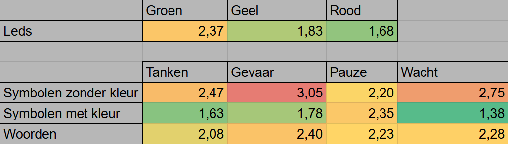

# RevUp

Een slimme GPS voor motorrijders die groepscommunicatie vergemakkelijkt en emotionele signalen kan vertalen naar acties zoals pauzes of routeaanpassingen.

*Projectteam: Diego Vande Vyvere; Mattiz Vermeulen* 

2024 - 2025  

---

## Samenvatting

Tijdens groepsritten op de motor of brommer ontstaan er geregeld communicatieproblemen, zeker bij onverwachte situaties zoals wegveranderingen, tankbeurten of stress. Met dit project willen we dit aanpakken door een slim GPS-systeem te ontwerpen dat via eenvoudige input en output (zoals knoppen en licht- of geluidsignalen) de communicatie stroomlijnt. In de discovery fase onderzochten we voorkeuren rond communicatievormen, outputtypes en routecoördinatie. Hierna worden de design requirements opgesteld om in de develop fase de uitgekomen eisen en wensen tot een finaal concept/ product uit te werken.

---

## Probleemstelling

Motorrijders in groep communiceren doorgaans via handgebaren of intercomsystemen. Handgebaren zijn echter niet altijd betrouwbaar, zeker niet in omstandigheden waar snelle respons, duidelijkheid of emotionele context vereist zijn. Intercomsystemen zijn echter duur, kunnen voor connectivity problemen zorgen en hangen af van de communicatie vaardigheden van de gebruiker. Het ontbreken van effectieve communicatie leidt regelmatig tot frustraties, onveiligheid en desorganisatie binnen de groep.

Daarbij is er momenteel geen systeem dat concrete signalen communiceert en daar actief op inspeelt. Stress, vermoeidheid of onzekerheid blijven onopgemerkt, met alle gevolgen van dien voor de veiligheid en rijervaring. Dit probleem wordt versterkt door de context van het motorrijden zelf: beperkte handvrijheid, hoge snelheden en visuele afleiding beperken de interactiemogelijkheden.

RevUp biedt hierop een antwoord via een combinatie van tactiele input (stuurknoppen) met visuele feedback en een mogelijkheid om audio apparaten te verbinden. Het systeem ondersteunt niet alleen communicatie over praktische zaken (bv. tanken, gevaren), maar maakt het ook mogelijk om onzichtbare signalen zoals vermoeidheid (pauze, wacht op mij) te communiceren en hier gepast op te reageren door de routebeschrijving aan te passen naargelang de noden.

---

## Methodologie

Door een zeer late pivot vanuit een ander project werd dit project uitgevoerd in een tijdsspan van 9 weken. Hierdoor kon het vooropgelegde stappenplan van het vak project gebruiksgericht ontwerp niet gevolgd worden. Er zal dus gebruik gemaakt worden van AI om orde en structuur, renders zoals hierboven en mogelijke elektronica vooruit te helpen, het gebruik van AI wordt telkens nagelezen en kritisch bekeken. Tijdens het ontwerptraject wordt alles op miro genoteerd, dit is een digitale whiteboard. Hierop werdt een tijdlijn opgesteld om voortgang wat te stuwen. Een nadeel hiervan is dat er minder itiratief nagedacht wordt, er wordt rap naar de volgende stap gekeken in plaats van terug te blikken naar de vorige.

De 9 weken werden als volgt verdeeld:

- **Fase 1: Desk Research & Enquête**  
  → Reddit-enquête bij motorrijders (20+ antwoorden)

- **Fase 2: Interviews (Wave 1, 2 & 3)**  
  → Diepte-interviews met rijders rond frustraties, communicatiegewoontes, routeplanning en beleving

- **Fase 3: Analyse & Synthese**  
  → Persona's, scenario’s, design criteria

- **Fase 4: Develop Fase**
  → Looks, informatie hyrarchie, uitwerken elektronica, ...

- **Fase 5: Delivery Fase**
  → Afwerking, video

- **Tijdslijn:** 
  - Week 1: Discovery
  - Week 2 t.e.m. week 5: Define
  - Week 6 t.e.m. week 9: Develop fase
  - Week 9: Delivery fase

---

## Discovery

### Doelstellingen

- Achterhalen hoe motorrijders communiceren in groep
- Inzicht krijgen in frustraties en emotionele triggers tijdens groepsritten
- Verkennen van technologiën rond input/outputvormen

### Materiaal & methoden

- Google Form vragenlijst (via Reddit)  (N = 59)
- Literatuurstudie Wave 1 (N = 4)
- Persona-ontwikkeling
- Online whiteboard Miro

### Resultaten

Tijdens groepsritten maken motorrijders doorgaans gebruik van intercomsystemen, handgebaren en vooraf gedeelde GPS-routes om met elkaar te communiceren. Deze strategieën blijken in de praktijk niet altijd toereikend: miscommunicatie ontstaat wanneer koppelingen uitvallen of bepaalde gebaren niet universeel gekend zijn binnen de groep. Veel gecommuniceerde onderwerpen zijn momenteel pauzes, tanken, politie, ...

Emoties kunnen op verschillende manieren opgemeten worden, GSR kan de geleidbaarheid van de huid meten en een hartslagmeter meet zoals de naam zegt je hartslag. Zo kan er automatisch een melding naar de groep gestuurd worden mocht er iets verkeerd lopen of als de gebruiker gestressed is op baan.

### Conclusies & implicaties

- Aandacht op de baan is belangrijk, er wordt dus gestreefd om het design zo intuitief mogelijk te maken
- Emotieherkenning heeft de mogelijkheid om automatisch bepaalde problemen te communiceren
- Routebepaling kan aangepast worden in functie van de emoties en noden van de groep

---

## Definition

### Doelstellingen

- Vaststellen van kernfunctionaliteiten en vereisten voor groepscommunicatie op de motor
- Integratie van emotiedetectie als niet-intrusieve aanvulling op communicatie
- Definiëren van input- en outputvoorkeuren op basis van gebruikersdata

### Materiaal en methoden

- Analyse van enquête en interviewresultaten (Wave 2 en 3) (N = 8)
- Persona-ontwikkeling en scenariobouw
- Synthese van fysieke en cognitieve voorkeuren voor productinteractie
- Vertaling naar concrete design requirements

### Resultaten

De resultaten van het gebruikersonderzoek en de bijhorende prototype-evaluaties tonen aan dat fysieke knoppen een duidelijke voorkeur genieten ten opzichte van touchscreens, voornamelijk wegens hun intuïtieve karakter, de minimale visuele belasting tijdens het rijden en hun geschiktheid voor gebruik met motorhandschoenen. Visuele feedback scoort het hoogst wanneer die gebaseerd is op duidelijke, eenduidige symbolen in combinatie met kleurgebruik. Deze combinatie leidt tot snellere herkenning en een betere informatieoverdracht dan tekstuele of auditieve meldingen alleen.

Gebruikers gaven tevens aan hun autonomie te willen behouden; notificaties moeten niet dominant aanwezig zijn, maar eerder subtiel en informatief. In het kader van groepscoördinatie werd de mogelijkheid om de route van de groepsleider te kunnen volgen als bijzonder nuttig ervaren. Dit draagt bij aan een gevoel van veiligheid en verbondenheid binnen de groep.

Tijdens de interviews werd herhaaldelijk twijfel geuit over het gebruik van sensoren voor emotieherkenning. Gebruikers gaven aan weinig vertrouwen te hebben in de betrouwbaarheid van zulke systemen, vooral wat betreft de interpretatie van stress- of emotionele signalen in een realistische rijcontext. Op basis van deze terugkoppeling werd besloten om af te zien van automatische sensordetectie. In plaats daarvan wordt er gekozen voor manuele inputopties, waarbij de rijder zelf aangeeft wanneer er nood is aan een pauze of andere actie. Dit garandeert meer controle, transparantie en vertrouwen in het systeem.

### Conclusies en implicaties (design requirements en beslissingen)

- Motorrijders willen autonomie behouden, maar ook comfort en duidelijkheid
- Emotiedetectie via sensoren is uitgesloten; het systeem gebruikt enkel manuele input.
  
- Knoppen zorgen voor een intuitieve manier om manueel input te geven zonder te veel congitief de gebruiker te belasten.
- Knoppen moeten duidelijk voelbaar zijn, met klikfeedback en geschikt voor gebruik met motorhandschoenen.
- Ze worden het best geplaatst aan de rechterkant van het stuur voor gemakkelijke bediening, maar hebben de mogelijkheid om op andere plaatsen te hangen.
  
- De interface moet eenvoudige symbolen en contrastrijke kleuren gebruiken voor leesbaarheid.
- Geef de gebruiker een optie om een directe route naar de groep te tonen als hij verdwaald geraakt
- Maak het mogelijk om te koppelen met bestaande com systemen voor auditieve feedback of meldingen

---

## Develop 1: Vormstudie inputknoppen & Interfacefeedback (N = 4)

### Doelstellingen

Het doel van deze fase was het analyseren en vergelijken van verschillende fysieke inputknoppen met de focus op gebruiksgemak tijdens het motorrijden, en het vergelijken van verschillende outputmogelijkheden van meldingen met de focus op cognitieve belasting.

### Materiaal en methoden

#### Testopzet

Vijf verschillende knoptypes werden op een stuurmock-up gepresenteerd. Respondenten evalueerden deze op:

- Vorm en grootte
- Gebruiksgemak
- Positionering ten opzichte van elkaar

Na deze beoordeling werd een point-of-view video van een motorrijder getoond, waarbij de respondent een helm opzette om een realistische rijsituatie te simuleren. Tijdens deze simulatie werden vier outputprototypes onder het scherm geplaatst:

- LED’s
- Zwart-wit symbolen
- Gekleurde symbolen
- Woorden gekoppeld aan kleuren

Respondenten gaven hardop aan wanneer ze een melding zagen, wat ze dachten dat deze betekende en hoe duidelijk die werd ervaren. De reactietijd werd geregistreerd, gevolgd door een korte reeks evaluatievragen over voorkeur en interpretatie.

De testopzet werd geoptimaliseerd voor zowel fysieke als cognitieve evaluatie en biedt een solide basis voor verdere iteratie van input/outputdesign binnen de RevUp-interface.

#### Prototypes

*Knoppen:*

  
  

 

*Output:*

  
  

 

### Resultaten

#### Observaties knopvoorkeuren

Rechthoekige knoppen werden door de meeste respondenten het snelst herkend, dankzij hun duidelijke vorm. Een voelbare klik werd als essentieel beschouwd voor betrouwbare feedback tijdens het rijden. Kleine of vlakke knoppen bleken minder geschikt, vooral in combinatie met motorhandschoenen. De voorkeur ging uit naar een verticale plaatsing van de knoppen, zodat de duimbeweging natuurlijk en intuïtief blijft.

  
  

 

#### Observaties Output

LED's en gekleurde symbolen scoorden het best, maar elk om een andere reden. LED's kunnen feller en sterker een melding tonen dan symbolen op een scherm maar kunnen niet zo veel info geven zonder context, symbolen daarintegen vallen minder hard op maar zijn makkelijker om te begrijpen. Ook de kleur van de meldingen speelt een rol; bij LED's is groen licht moeilijker op te merken dan rood of geel licht, op een scherm is blauw licht wat moeilijker op te merken.

  
  

 

### Conclusies en implicaties (design requirements en beslissingen)

- Knopvorm: Vierkant/ rechthoekig, breed oppervlak, duidelijke feedback (klik/veer)
- Interface: Symbolen met vaste kleurcode, vermijd overbodige tekst, toevoegen van LED's om belangrijke meldingen rapper op te merken.
- Fysieke ergonomie: Knoppen boven elkaar uitlijnen om beweging en reach van de duim te volgen
- Cognitieve ergonomie: Beperk visuele input, vermijd dubbelzinnige signalen, geef de knoppen een eigen identiteit (kleur, textuur, …), vermijd een donkerblauwe kleur bij meldingen.

---

## Develop 2: Prototype-evaluatie (N=4)

### Doelstellingen (cfr. methodologie)

Valideren van het finale prototype op gebruiksvriendelijkheid, plaatsing, en intuïtieve interactie.

### Materiaal en methoden

- Wizard-of-Oz testing
- Interviews
- Plaatsingsoefening (knoppen en scherm)
- BERT-evaluatie uiterlijk en gebruik

*prototype:*

  
  
  

 

### Resultaten

  
  

 

### Conclusies en implicaties (design requirements en beslissingen)

- Knoppen zijn voldoende voelbaar, maar verbeterbaar in tactiele differentiatie
- Suggestie voor extra confirmatieknop of tijdsgebonden bevestiging
- Schermfeedback is duidelijk, maar meldingen mogen niet te veel de routevoorstelling belemmeren
- Plaatsing aan linkerstuurzijde is optimaal

  
  

 

---

## Conclusie

Het RevUp-systeem biedt een tastbare meerwaarde voor het verbeteren van communicatie en veiligheid tijdens groepsritten met de motor. Door gebruik te maken van fysieke stuurknoppen, duidelijke visuele feedback en compatibiliteit met bestaande intercomsystemen, wordt het voor rijders mogelijk om snel en intuïtief cruciale informatie met elkaar te delen. De bewuste keuze om emotieherkenning enkel manueel te integreren garandeert de autonomie en het vertrouwen van de gebruiker. Het project toont aan dat een mensgericht ontwerp, opgebouwd uit iteratief gebruikersonderzoek, kan leiden tot een systeem dat zowel technisch uitvoerbaar als gebruiksvriendelijk is. RevUp vormt daarmee een sterke basis voor verdere ontwikkeling en integratie van slimmere rijhulpsystemen binnen de context van motorgroepen.

- Tabel met de finale design requirements

| ID       | Design Requirements                                                                 | Waar?                  | Notes                                                                 |
|:--------|:------------------------------------------------------------------------------------|:-----------------------|:----------------------------------------------------------------------|
| **1.0**  | **Input**                                                                           |                        |                                                                       |
| 1.1      | Er zijn vijf duidelijk inputs                                                       |                        |                                                                       |
| 1.1.1    | Wacht op mij                                                                        | Wave 1 raport          |                                                                       |
| 1.1.2    | Pauze                                                                               | Wave 1 raport          |                                                                       |
| 1.1.3    | Tanken                                                                              | Wave 2 raport          |                                                                       |
| 1.1.4    | Gevaar                                                                              | Wave 2 raport          |                                                                       |
| 1.1.5    | Confirmatie van melding                                                             | Develop 2 Raport       | knop aan zijkant                                                      |
| 1.2      | Het gebruik blijft zo intuitief mogelijk om de aandacht op baan te houden          | Definition             |                                                                       |
| 1.3      | De input gebeurd dmv knoppen                                                        | Wave 2 & 3 Raport      |                                                                       |
| 1.4      | Er is een mogelijkheid om andere betekenissen aan de inputs toe te kennen.          | Wave 3 Raport          |                                                                       |
| 1.5      | De knoppen kunnen met gemak aan het stuur vast hangen                               | Wave 3 Raport          |                                                                       |
| 1.6      | De knoppen kunnen naar keuze van de gebruiker op andere posities hangen             | Wave 3 Raport          |                                                                       |
| 1.7      | De 4 knoppen zijn opgesteld boven elkaar                                            | Develop 1 Raport       |                                                                       |
| 1.8      | De knoppen zijn duidelijk te onderscheiden                                          |                        |                                                                       |
| 1.8.1    | De knoppen zijn rechthoekig met een breed oppervlak                                 | Develop 1 Raport       | momenteel: 15 x 10 mm is goed                                         |
| 1.8.2    | Er is genoeg plaats tussen de knoppen                                               | Develop 1 Raport       | momenteel: 5 mm is goed                                               |
| 1.8.3    | Elke knop heeft een eigen textuur                                                   | Develop 2 Raport       |                                                                       |
| **2.0**  | **Output**                                                                          |                        |                                                                       |
| 2.1      | De output valt op zonder te veel aandacht te vragen                                 | Definition             |                                                                       |
| 2.1.1    | De letters/ symbolen zijn groot genoeg                                              | Definition             | 2 cm hoog op yamaha MT 125                                            |
| 2.1.2    | Er is een scherm die de routebeschrijving en mogelijke communicatie toont           | Wave 2 Raport          |                                                                       |
| 2.3      | De visuele output is sterk genoeg in zonlicht                                       | [Referentie](https://nl.doitvision.com/how-many-nits-of-brightness-is-good-for-outdoor-led-display/) | hoeveel nits? -> 8000-15000 nits |
| 2.4      | Er is een kapje boven het scherm die zonlicht wat blokkeert                         | Wave 3 Interview       | Zoals Verkeerslicht                                                   |
| 2.5      | Er zijn duidelijke meldingen om te communiceren                                     | Wave 1 Raport          |                                                                       |
| 2.5.1    | Op het scherm zijn symbolen te zien als er iemand een input geeft                   | Develop 1 Raport       |                                                                       |
| 2.5.2    | De belangrijkst meldingen zijn gekoppeld met een led om rapper aandacht te trekken (gevaar & wacht op mij) | Develop 2 Raport |                                                                       |
| 2.5.3    | Elke melding heeft zijn eigen kleur                                                 | Develop 1 Protocol     |                                                                       |
| 2.5.3.1  | Tanken => Groen                                                                     | Develop 1 Protocol     |                                                                       |
| 2.5.3.2  | Gevaar => Rood                                                                      | Develop 1 Raport       |                                                                       |
| 2.5.3.3  | Wacht op mij => Geel                                                                | Develop 1 Raport       |                                                                       |
| 2.5.3.4  | Pauze => Licht blauw                                                                | Develop 2 Interview    |                                                                       |
| 2.6      | De meldingen belemmeren de routevoorstelling niet                                   | Develop 2 Raport       |                                                                       |
| **3.0**  | **Routevoorstelling**                                                               |                        |                                                                       |
| 3.1      | Top down view                                                                       | Wave 3 Raport          |                                                                       |
| 3.2      | Het product heeft een toggle tussen route naar de leider en naar de eindbestemming  | Wave 3 Raport          |                                                                       |
| 3.3      | Het systeem kan shortcuts voorstellen als er iemand achter loopt of een verkeerde afslag pakt | Wave 3 Interview |                                                                       |
| **4.0**  | **Verbinding**                                                                      |                        |                                                                       |
| 4.2      | Het product heeft de mogelijkheid om met intercoms te verbinden voor auditieve feedback | Wave 1 & 2 Raport  |                                                                       |
| 4.3      | Het product heeft een bereik van 1 km                                               | Wave 3 Interview       | bereik van bestaande intercoms                                        |

---

## To Do
Doordat we een zeer kort designtraject afgelopen hebben zijn er dingen die we nog willen onderzoeken/ afwerken, de belangrijkste hiervan zijn:
- Uitwerken routebeschrijving en het short-cut systeem voor achterliggers
- Lay-out gps mototvriendelijk maken (mogelijkheid om vrienden te zien, ...)
- Uitwerken verbinding tussen RevIt's (gebruiksvriendelijkheid, technologie, ...)
- Uitwerken main body (scherm met leds in één body, elektronica, ...)
  
---

## Technische beschrijving

Het scherm is cirkelvormig en hangt met een korte arm aan het stuur vast, rond het scherm zit een ledring voor extra visuele feedback. Er zijn ook knoppen die waarschijnlijk aan de linkerkant van het stuur hangen maar de mogelijkheid hebben om door de gebruiker zelf geplaatst te worden. De knoppen verschillen niet veel van de render uit develop 2, maar bevatten een extra conformatie knop aan de bovenkant.

  
  

 

|Naam Component|Hoe te verkrijgen|
|----|---|
|GPS-module met visueel scherm of LED-feedback| [scherm](https://benl.rs-online.com/web/p/shields-for-arduino/2686967?matchtype=&pla-332297889548&gad_campaignid=21302633171) en [GPS](https://www.amazon.com.be/-/en/Aideepen-Position-Module-Antenna-Controller/dp/B08CZSL193/ref=asc_df_B08CZSL193?mcid=8d9b5cb1884e3ab5835972e6c94a0470&hvadid=712673940446&hvpos=&hvnetw=g&hvrand=6716657762156146757&hvpone=&hvptwo=&hvqmt=&hvdev=c&hvdvcmdl=&hvlocint=&hvlocphy=9195761&hvtargid=pla-967402262363&psc=1&language=en_GB)|
|Drukknoppen (input)| 3D Printen en [Kopen](https://www.hobbyelectronica.nl/product/tactile-drukknop-25-stuks-met-cap/?gad_campaignid=17423797364)|
|Bevestigingselementen (stuur)| 3D Printen|
|Communicatiemodule (voor koppeling met intercom)|...|

---

## Kritische reflectie
Zoals vermeld in de methodologie zorgde de korte periode voor een ietwat minder itiratief ontwerpproces, hierdoor bleven er lang vragen rond de in- en output systemen en is er niet veel nagedacht over de routebeschrijving, het linken van de RevUp's en andere digitale UX.

De respondenten van onze user tests en interviews vallen vaak in dezelfde motorgroep, hierdoor is er een kans dat het product gemaakt is op de noden van 1 doelgroep en niet alle motorrijders.

---

## Bronnen
- Doe, J. (2023). *Designing Interfaces for Riders*. Journal of Transport UX.
- Smith, K. (2022). *Smart Navigation in Motion*. Mobility Review.
- Scribbr. (2023). APA-stijl. https://www.scribbr.nl/apa-stijl
- [stock_motorcycle_handlebar_measurements_cruisers.pdf](https://github.com/Diego-vdv/UCD/blob/main/files/Develop%201/Varia/stock_motorcycle_handlebar_measurements_cruisers.pdf)

---

## Bijlagen
- Vragenlijstresultaten
- Literatuurstudie Wave 1
- Interviewprotocol en raport Wave 2 & 3
- Persona: “Thomas – de weekendrijder”
- Design requirements

